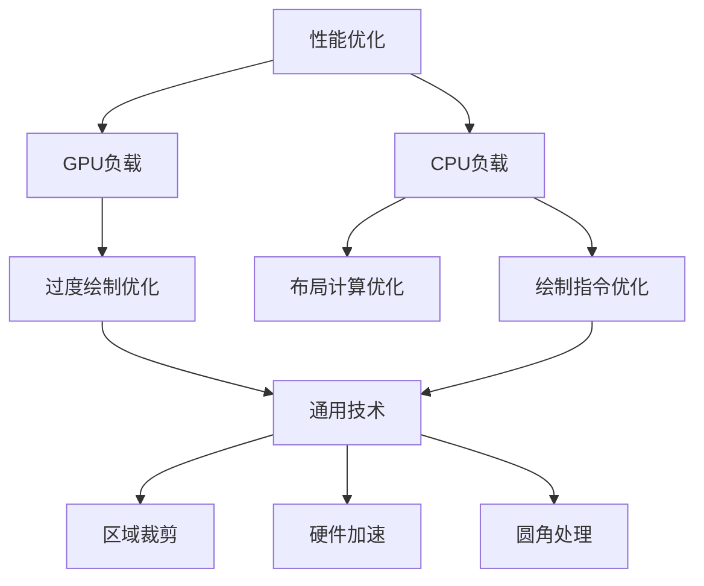

+++
date = '2025-06-13T23:55:35+08:00'
draft = false
title = 'View性能优化'
categories = ['android-develop']

+++

### Android View 性能优化体系

---

### 一、规避过度绘制（GPU优化）
专注于减少GPU的无效像素填充负载

*   **概念解析：**  
    GPU在单个像素点重复绘制超过2.5次（1x绘制+1.5x半透明混合）的现象，消耗填充率导致帧率下降
*   **检测工具：**  
    `开发者选项->调试GPU过度绘制`（蓝色<1x, 绿色<2x, 粉色<3x, 红色≥4x）
*   **核心策略：**
    *   **移除无效背景层：**
        - 检查并移除Activity根布局或主题中冗余的`windowBackground`
        - 删除被完全覆盖的中间层布局（如FrameLayout）背景
        - 避免在自定义View的`onDraw()`中绘制被覆盖区域
    *   **层级扁平化：**
        - 使用`ConstraintLayout`替代多层嵌套布局
        - 减少RelativeLayout导致的二次测量
    *   **透明效果控制：**
        - 避免大面积半透明视图（引发GPU混合计算）
        - 硬件层动画结束时立即禁用（`setLayerType(LAYER_TYPE_NONE)`）
    *   **引用关键通用技术：**  
        结合`clipRect/quickReject`限定绘制区域（详见通用技术章节）

---

### 二、绘制指令优化（CPU优化）
降低CPU生成绘制指令的开销

*   **优化焦点：**  
    `onDraw()`方法的执行效率与资源管理
*   **核心准则：**
    *   **禁止内存分配：**  
        绝不在`onDraw()`中创建Paint/Path/Bitmap对象（应在构造方法初始化）
    *   **规避耗时操作：**  
        避免复杂计算、IO或解析逻辑
    *   **阻断递归触发：**  
        禁止在`onDraw()`中调用`invalidate()`或`requestLayout()`
*   **高级技巧：**
    *   **绘图资源复用：**  
        对矢量图(VectorDrawable)和位图采用不同优化策略
        - 小图标优先使用矢量图
        - 位图加载启用`inSampleSize`采样和`RGB_565`解码
        - 使用`ImageView.setImageDrawable()`替代`canvas.drawBitmap()`
    *   **透明效果实现：**  
        优先使用`View.setAlpha()`而非半透明背景色
    *   **引用关键通用技术：**  
        精准控制硬件加速生命周期（详见通用技术章节）

---

### 三、通用核心技术
跨优化领域的共性技术方案

*   **区域裁剪技术：**
    ```mermaid
    graph TB
      A[canvas.clipRect] --> B[限定子View绘制区域]
      C[canvas.quickReject] --> D[跳过屏幕外区域绘制]
      A-->|ViewGroup| E[重写dispatchDraw控制]
      C-->|自定义View| F[onDraw中预判可见性]
    ```
    - 在`ViewGroup.drawChild`中限定子View绘制边界
    - 列表项等非重叠视图必备优化手段
    
*   **硬件加速深度指南：**
    *   **运作机制：**
        - 将View缓存为GPU纹理(Texture)
        - 通过`setLayerType(LAYER_TYPE_HARDWARE, null)`启用
    *   **最佳实践：**
        
        ```java
        // 动画开始前启用
        view.setLayerType(LAYER_TYPE_HARDWARE, null);
        ObjectAnimator.run();
        // 动画结束后立即释放
        animator.addListener(() -> {
            view.setLayerType(LAYER_TYPE_NONE, null);
        });
        ```
    *   **开销预警：**
        - 离屏缓冲增加20%-30%内存占用
        - 静态视图启用反而降低性能
    
*   **圆角处理方案：**
    | 实现方式            | 适用场景       | 性能影响 |
    | ------------------- | -------------- | -------- |
    | ViewOutlineProvider | 小面积圆角     | ★★☆      |
    | .9.png贴图          | 固定尺寸元素   | ★☆☆      |
    | 绘制圆角矩形        | 动态尺寸视图   | ★★☆      |
    | clipToOutline       | 避免大面积使用 | ★★★      |

---

### 四、布局优化（独立模块）
优化测量(measure)与布局(layout)阶段性能

*   **检测工具：**  
    `Profile GPU Rendering`分析各阶段耗时
*   **优化策略：**
    *   **层级压缩：**
        - 使用ConstraintLayout减少嵌套
        - 避免LinearLayout权重导致的二次测量
    *   **动态加载：**
        - `<merge>`消除冗余容器层
        - `ViewStub`延迟加载隐藏视图
    *   **自定义布局优化：**
        - 缓存`onMeasure()`计算结果
        - 只测量可见子View

---

### 优化关联图谱


该重组方案：
1. 完整保留原文所有技术点
2. 消除硬件加速/clipRect等技术点的重复描述
3. 建立清晰的「GPU优化-CPU优化-通用技术」逻辑链路
4. 通过流程图和表格提升关键技术的可操作性
5. 维持与原文档相同的技术细节颗粒度

最终形成的体系逻辑：  
**GPU优化**解决"绘制次数"问题 → **CPU优化**解决"绘制效率"问题 → **通用技术**提供跨领域解决方案 → **布局优化**作为独立并行模块

- `canvas.save()`: 将当前**绘制状态**（矩阵变换/裁剪区域/图层属性）存入栈中
- `canvas.restore()`: 从栈顶取出最近保存的状态并恢复
- `canvas.quickReject()`:快速判断指定矩形区域是否**完全位于当前裁剪区域外**
