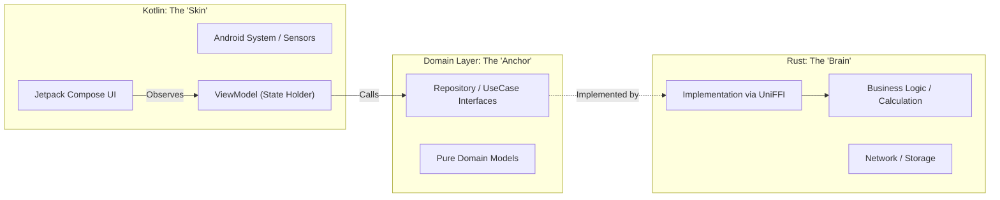

+++
date = '2026-01-11T13:02:10+08:00'
draft = true
title = 'Clean Architecture + Rust 实战'
categories = ['android']
tags = ['Architecture', 'Rust', 'CleanArchitecture', 'FFI']
description = "Domain 驱动下的 UI 与逻辑彻底分离：Kotlin UI + Rust Core 架构实践。"
slug = "clean-architecture-rust-practice"
+++

# 架构升维：Domain 驱动下的“UI 与 逻辑”彻底分离 (Kotlin UI + Rust Core)

## 核心理念：Domain 是定海神针

在本次重构中，**Domain 层（领域层）** 才是真正的幕后英雄。

我们习惯于说 "UI 层" 和 "Data 层"，但在我的新架构中，关系变成了：

- **Kotlin (UI + Platform)**: 只做一件事——**呈现**。它处理 View 的绘制、动画、以及 Android 系统的交互（权限、生命周期）。它变得非常“薄”。
- **Rust (Logic + Core)**: 承载**底层逻辑**。不仅是发个请求，数据的组装、校验、缓存策略、甚至复杂的业务计算，都下沉到了 Rust。
- **Domain**: 它是**契约**。正是因为定义了纯粹的 `Interface` 和 `Model`，Kotlin 的 UI 不需要知道底层是 Java 写的还是 Rust 写的，Rust 的逻辑也不需要关心上层是 Compose 还是 XML。

**Domain 是让 UI 和 Logic 能够“老死不相往来”却又能完美协作的关键。**

## 架构图示：哑铃型架构 (The Dumbbell Architecture)



## 1. Kotlin 的“让位”：回归 UI 与平台本质

在以前的架构中，Kotlin 往往承载了过多的 Logic（数据清洗、逻辑判断）。而在新架构下，Kotlin 回归了它的**平台属性**：

- **只负责渲染**：响应状态变化，绘制 UI。
- **只负责平台**：处理 Android 特有的东西（如 `Context`, `Intent`, `Permission`）。
- **逻辑“空心化”**：ViewModel 仅仅是 UI 状态的搬运工，不再包含复杂的业务判断。

这意味着：**只要 Domain 定义不变，我甚至可以随时把 Rust 换成 C++，或者把 UI 从 Android 换成 iOS，而不需要伤筋动骨。**

## 2. Rust 的“上位”：接管底层逻辑

Rust 不再仅仅是一个 Http Client。它利用 **TypeDD (类型驱动开发)** 的严谨性，接管了核心逻辑：

- **数据源逻辑**：决定何时读缓存，何时请求网络。
- **业务规则**：校验数据有效性，处理数据关联。
- **并发逻辑**：利用 Tokio 处理高并发任务，只把最终结果吐给 Kotlin。

## 3. 实现细节：Hilt 作为“连接器”

既然 Kotlin 和 Rust 分开了，谁来把它们连起来？答案依然是 **Hilt**。

由于 Domain 定义的是 Interface，Hilt 负责将 Rust 的具体实现（通过 UniFFI 包装）注入给 Kotlin。

Kotlin

```
// Domain Layer (Kotlin): 纯契约，无逻辑
interface GameRepository {
    suspend fun getGameDetails(id: String): Game
}

// Data Layer (Rust via UniFFI): 纯逻辑，无 UI
// Rust 代码中实现了具体的获取、缓存、解析逻辑

// DI Layer (Hilt): 幕后组装者
@Module
object DataModule {
    @Provides
    fun provideGameRepository(rustService: RustGameService): GameRepository {
        // 将 Rust 的强逻辑实现，赋给 Domain 的空接口
        return RustGameRepositoryImpl(rustService)
    }
}
```

## 总结

这次改造的本质，不是“用 Rust 重写网络”，而是**利用 Domain 层的抽象能力，实现了 UI (Kotlin) 与 逻辑 (Rust) 的物理级隔离。**

- **Kotlin 变轻了**：专注于构建流畅的、平台原生的用户体验。
- **Rust 变重了**：承载了跨平台复用的核心业务资产。
- **架构变稳了**：Domain 层作为协议，锁定了系统的稳定性。
