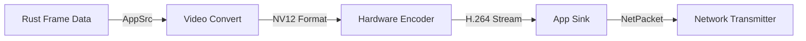

+++
date = '2026-02-15T12:46:14+08:00'
draft = true
title = 'Embers_stream_tech_blog_1'
+++

## 1. 架构现状

我们遵循**DDD（领域驱动设计）**原则，将系统分为纯净的**领域层（Domain）**和负责具体实现的**基础设施层（Infrastructure）**。

### 1.1 领域层（Domain Layer）

定义了云游戏视频流的核心抽象，不依赖任何具体平台或底层库。

* 核心抽象
  * **CaptureSource (Trait)**:屏幕捕获的标准接口。
  * **NetworkTransmitter(Trait)**: 网络发送的标准接口。
* 核心数据
  * Frame：原始视频帧（Raw BGRA Data），包括分辨率、像素格式等元数据。
  * NetPacket：网络传输包，包含序列号、负载数据和类型标识。

### 1.2 基础设施层（Infrastructure Layer）

负责与操作系统和硬件打交道。

* CGDisplayCapture(macOS)
  * 实现了`CaptureSource`接口
  * 使用 macOS 原生`CoreGraphics`API 进行高效抓屏
  * 包含处理 C FFI 的安全封装和状态机管理

这种分离确保了 core logic 的可测试性和可移植性。

## 2. 核心挑战：视频编码（The Encoder）

当前最紧迫的任务是将原始的 BGRA 数据（极高带宽）压缩为适合网络传输的 H.264/VP9 码流。

### 2.1 技术选型

我们选择`GStreamer(gstreamer-rs)`作为核心编码框架，原因如下：

* 安全性：拥有高质量的 Rust safe bindings，避免了 FFmpeg 常见的 unsafe 内存陷阱。
* 架构契合：Pipeline 架构天然契合流媒体处理流程。
* 跨平台：统一了 macOS（VideoToolbox）、Linux（VAAPI/NVENC）和 Windows（Media Foundation）的硬件加速接口。

### 2.2 流水线设计

我们将构建如下的 GStreamer 处理流水线：

#### 组件详解

1. AppSrc：Rust -> GStreamer的桥梁。我们将`Frame`数据的内存引用喂给它。
2. Video Convert：自动完成色彩空间转换（BGRA -> NV12/l420）,适配编码器需求。
3. Encoder：根据平台自动选择硬件编码器（如 macOS 上的`vtenc_h264`）。
4. AppSink：GStreamer -> Rust 的桥梁。当压缩数据准备好时，回调 Rust 代码封装成`NetPacket`。
