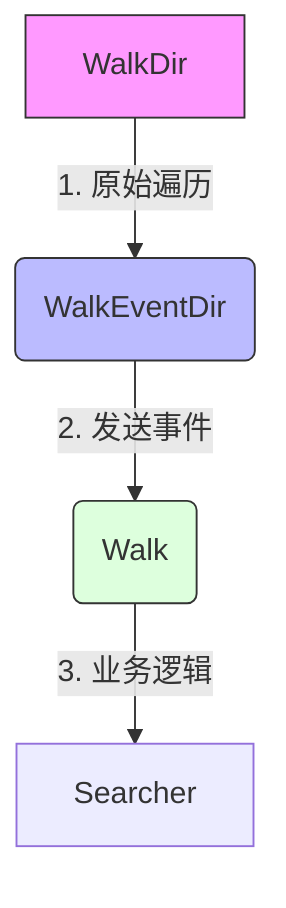

在阅读 Rust 顶级开源项目 `ripgrep` (rg) 的源码时，最让我印象深刻的不是它对 SIMD 的极致优化，而是它清晰的**职责分离 (Separation of Concerns)** 设计。

架构设计的核心在于：**如何控制复杂度**。

### 1. 思维转变：从“实现”到“组合”

#### 一体式思维 vs 分离式思维
* **一体式 (Monolithic)**：
    * 思维模式：“我要写一个函数，在这个函数里遍历文件，然后打开文件，查找字符串，最后打印出来。”
    * 结果：产生一个巨大的 `run()` 函数，逻辑高度耦合，改一个地方坏三个地方。
* **分离式 (Composable)**：
    * 思维模式：“我要设计几个组件：一个负责找文件，一个负责搜内容，一个负责打印。然后把它们组合起来。”
    * 结果：代码由多个小而美的 struct 组成，像搭积木一样构建应用。

#### 功能优先 vs 测试优先
* **功能优先**：先写代码，写完了再想“这坨代码怎么测”。通常结果是没法测，因为网络请求和业务逻辑混在一起。
* **测试优先**：为了能写出单元测试，强迫自己把“纯逻辑”从“副作用（IO）”中剥离出来。
    * *启示*：**可测试性是检验架构好坏的金标准。**

### 2. 实战案例：ripgrep 的分层架构

`ripgrep` 的作者 BurntSushi 是 Rust 社区公认的 API 设计大师。他的代码完美诠释了如何拆解复杂系统。

#### 2.1 配置解析的解耦 (`LowArgs` -> `HiArgs`)
并在 `main.rs` 里一股脑解析所有参数，而是分了两层：

* **`LowArgs` (Raw Data)**: 
    * **职责**：直接对应 CLI 传入的原始参数（字符串、布尔值）。
    * **特点**：只负责“接数据”，不负责校验逻辑冲突。
* **`HiArgs` (Domain Object)**:
    * **职责**：将 `LowArgs` 转换为业务逻辑可理解的配置对象。
    * **逻辑**：处理参数冲突（如 `--smart-case` 覆盖 `--ignore-case`），设置默认值。
    
**优势**：业务逻辑层（Searcher）只需要面对干净、类型安全的 `HiArgs`，完全不知道 CLI 的存在。

#### 2.2 核心流程分离：发现 vs 搜索
`ripgrep` 将“找文件”和“搜文件”彻底拆开：

1.  **文件发现 (Discovery)**: 负责遍历目录树，处理 `.gitignore` 规则，输出文件路径流。
2.  **目标搜索 (Searching)**: 接受文件路径（或 reader），在流中查找模式匹配。

这种分离使得 `ripgrep` 可以轻松替换输入源（比如从 stdin 读取，或者只搜索特定文件列表），而不需要修改搜索算法本身。

#### 2.3 极致的文件遍历抽象
这是 `ripgrep` 最精彩的部分。文件遍历并不是一个简单的 `for` 循环，而是一个层层包装的迭代器管道：

1. **WalkDir**: 最底层的库（也是 BurntSushi 写的）。负责将目录树形结构拉平成线性的 Iterator。它只管“走路”，不管规则。

2. **WalkEventDir**: 在遍历过程中发送事件（Enter Directory, Exit Directory）。

3. **Walk (With Ignore)**: 在 WalkDir 之上添加了“忽略规则”层。它读取 .gitignore，如果不符合规则，直接在迭代器层面 skip，根本不会把文件路径传给上层。

### 3. 总结
好的架构不是设计出来的， 而是重构出来的。`ripgrep`告诉我们：
* 把“做什么”和“怎么做”分开。
* 把“配置解析”和“程序运行”分开
* 利用 Rust 的`Iterator`和`Trait`系统，将复杂的流程拆解为多个单一职责的管道。