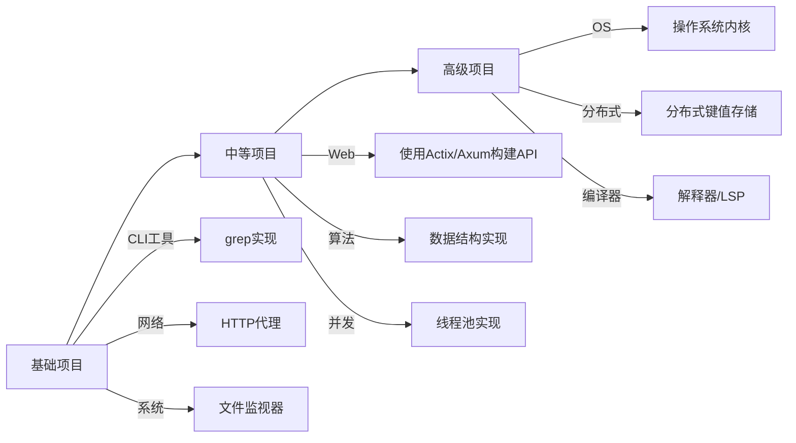

+++
date = '2025-08-08T11:37:40+08:00'
draft = false
title = 'Rust学习计划'

categories = ['rust']

+++

#### 一、巩固基础

##### 1. 精读《Rust程序设计语言》

	* 重读 [The Book](https://doc.rust-lang.org/book/)并完成所有课后练习
	* 重点章节：所有权、错误处理、泛型、trait、声明周期、智能指针、并发

##### 2. 标准库深度探索

* 掌握核心traits：`From`/`Into`, `TryFrom`/`TryInto`, ` AsRef`/`AsMut`, `Deref`等
* 使用 `cargo doc --open` 本地标准库文档并阅读源码

#### 二、项目实践



#### 三、深度进阶

##### 1. 内存与优化

	* 学习`pref`性能分析工具
	* 实践`#[inline]`, `Box<[T]>` vs `Vec<T>`等优化
	* 阅读Rust性能指南

##### 2. 高级特性精通

* 宏编程
* 不安全Rust的正确使用
* Pin/Unpin与自引用结构
* Tokio/Async高级模式

#### 四、社区参与（持续进行）

1. **代码贡献**

   * 参与`tokio`等知名项目
   * 解决`good-first-issue`标签问题

2. **知识输出**

   * 写技术博客解释Rust概念
   * 在StackOverflow回答问题

3. **核心学习资源**

   ```diff
   + 2024推荐：
   - 书籍：《Command-Line Rust》(O'Reilly)
   - 视频：Jon Gjengset的"Crust of Rust"系列
   - 社区：r/rust 每日阅读
   - 实践：Advent of Code挑战
   ```

#### 最后建议

当遇到困难时：

1. 使用 cargo clippy 和 cargo miri 辅助诊断
2. 在 [Rust用户论坛](https://users.rust-lang.org/) 提问
3. 阅读标准库相关模块源码（`std::collections` 是很好的起点））
