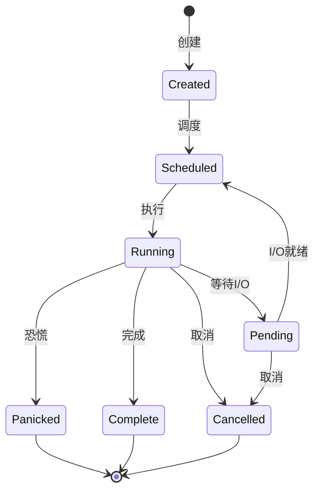
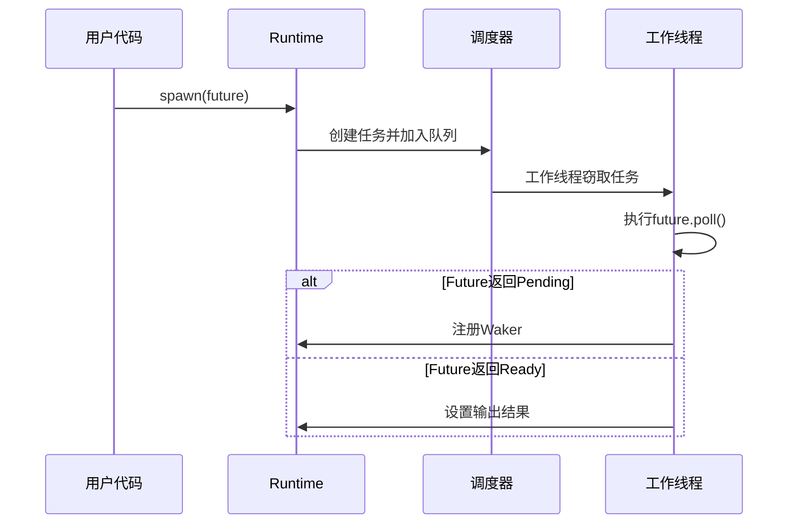
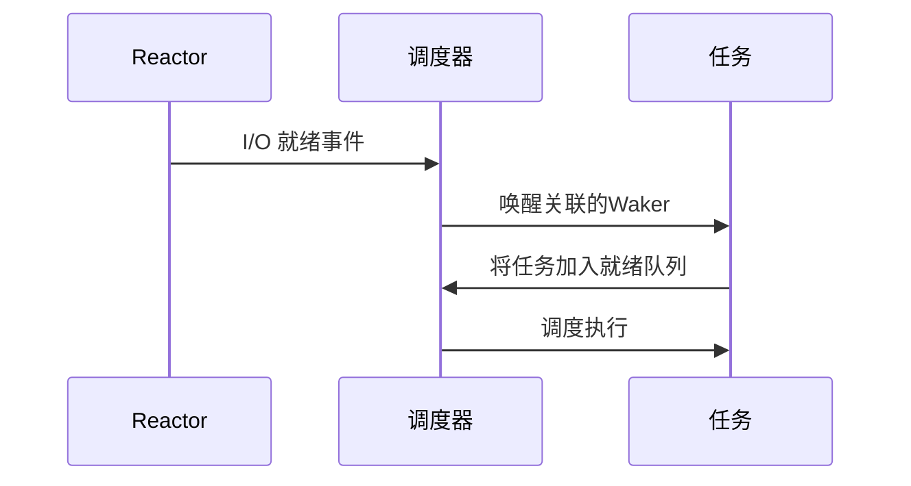

+++
date = '2025-09-19T13:50:29+08:00'
draft = false
title = 'Tokio核心模型解析'
categories = ['rust', 'tokio']

+++

# Tokio 核心模型解析

让我们从顶层设计开始，逐步深入 Tokio 的异步运行时模型。

## 1. 核心抽象模型

```
+-------------------------------------------------+
|                Runtime (运行时)                  |
|  +-------------------------------------------+  |
|  |              Reactor (反应器)              |  |
|  |  - I/O 多路复用 (epoll/kqueue/IOCP)        |  |
|  |  - 处理 I/O 事件通知                        |  |
|  +-------------------------------------------+  |
|                                                 |
|  +-------------------------------------------+  |
|  |              Scheduler (调度器)            |  |
|  |  - 多线程工作窃取调度                      |  |
|  |  - 任务队列管理                            |  |
|  +-------------------------------------------+  |
|                                                 |
|  +-------------------------------------------+  |
|  |               Timer (定时器)               |  |
|  |  - 管理定时任务                            |  |
|  |  - 基于时间轮的定时器实现                   |  |
|  +-------------------------------------------+  |
+-------------------------------------------------+
```

## 2. 任务生命周期模型

### 2.1 任务状态机



### 2.2 状态位表示

```rust
// 状态位域
const RUNNING: usize = 0b0001;      // 任务正在执行
const COMPLETE: usize = 0b0010;     // 任务已完成
const NOTIFIED: usize = 0b0100;     // 任务已通知调度器
const JOIN_INTEREST: usize = 0b1000; // 有任务在等待Join
const JOIN_WAKER: usize = 0b1_0000;  // 已设置Join Waker
const CANCELLED: usize = 0b10_0000;  // 任务已取消
```

## 3. 核心数据结构

### 3.1 任务结构 (RawTask)

```rust
struct RawTask {
    header: Header,          // 任务头信息
    scheduler: Scheduler,    // 调度器
    state: State,           // 任务状态
    future: Future,         // 要执行的Future
    output: Option<Output>, // Future的输出
}
```

### 3.2 调度器模型

```
+----------------+     +----------------+     +----------------+
|   Local Queue  | <-> | Global Queue  | <-> | Worker Threads |
+----------------+     +----------------+     +----------------+
        ^                     ^                       ^
        |                     |                       |
        v                     v                       v
+----------------+     +----------------+     +----------------+
| Task Producer  |     | Work Stealing  |     | Task Consumer  |
| (spawn)        |     | (负载均衡)      |     | (poll)         |
+----------------+     +----------------+     +----------------+
```

## 4. 执行流程

### 4.1 任务创建与调度



### 4.2 I/O 就绪处理



## 5. 关键优化技术

### 5.1 无锁队列

```rust
// 使用crossbeam的无锁队列
type TaskQueue = crossbeam_deque::Worker<Arc<Task>>;
```

### 5.2 工作窃取

```rust
// 工作线程尝试从其他队列窃取任务
fn steal_work(&self) -> Option<Task> {
    // 随机选择受害者队列
    let len = self.workers.len();
    let start = self.rng.usize(..len);
    
    for i in 0..len {
        let idx = (start + i) % len;
        if let Some(task) = self.workers[idx].steal() {
            return Some(task);
        }
    }
    None
}
```

### 5.3 零成本抽象

```rust
// 使用泛型和编译期多态
fn spawn<F, T>(future: F) -> JoinHandle<T>
where
    F: Future<Output = T> + Send + 'static,
    T: Send + 'static,
{
    // 编译时生成特定类型的代码
}
```

## 6. 内存模型

### 6.1 任务分配

```rust
// 自定义内存分配器优化
let layout = Layout::new::<Header>()
    .extend(Layout::new::<Scheduler>())?.0
    .extend(Layout::new::<T>())?.0;
let ptr = alloc(layout);
```

### 6.2 引用计数

```rust
// 使用原子引用计数管理任务生命周期
struct Task {
    header: Arc<Header>,
    // ...
}

impl Drop for Task {
    fn drop(&mut self) {
        if Arc::strong_count(&self.header) == 1 {
            // 最后一个引用，释放资源
        }
    }
}
```

## 7. 调试与追踪

```rust
#[cfg(tokio_unstable)]
struct TaskMeta {
    name: &'static str,
    location: &'static std::panic::Location<'static>,
    // ...
}
```

## 8. 使用模型

### 8.1 基本使用

```rust
#[tokio::main]
async fn main() {
    // 创建任务
    let handle = tokio::spawn(async {
        // 异步代码
        "Hello, Tokio!"
    });

    // 等待任务完成
    let result = handle.await.unwrap();
    println!("{}", result);
}
```

### 8.2 任务间通信

```rust
// 使用通道进行任务间通信
let (tx, mut rx) = tokio::sync::mpsc::channel(32);

// 生产者任务
tokio::spawn(async move {
    tx.send("Hello").await.unwrap();
});

// 消费者任务
tokio::spawn(async move {
    while let Some(message) = rx.recv().await {
        println!("received: {}", message);
    }
});
```

## 9. 性能考量

1. **任务大小**：保持任务小巧高效
2. **避免阻塞**：不要在异步上下文中执行阻塞操作
3. **批量处理**：合并小的I/O操作为批量操作
4. **合理使用spawn**：避免创建过多任务

## 10. 调试技巧

1. 启用 `tokio_unstable` 特性获取更多调试信息
2. 使用 `tracing` 进行分布式追踪
3. 监控运行时指标（任务数、队列长度等）

这个模型展示了 Tokio 如何高效地管理异步任务。理解这些核心概念后，您可以更深入地研究特定组件的实现细节。
